# Projeto Supermercado

O projeto do supermercado é feito em C e baseado nos conceitos principais estudados em Estrutura de Dados, seguindo os seguintes critérios:

1. Login de acesso: utilizando arquivos, struct, ordenação e busca binária
2. Abastecimento das Gôndolas: utilizando arquivos, struct e Pilha
3. Caixa/PDV: utilizando arquivos, struct e Fila

 

OBS: A linguagem C gera um arquivo executável em interface CLI (ou seja, não possui interface gráfica).

## Telas e Regras de Negócio

### 1. Tela de Login

O login é realizado através da consulta de dados no arquivo usuarios.dat. Para realizar o login, é feito busca binária para otimizar o algoritmo.
Ao realizar o login e ao sair do sistema, os dados de log são armazenados em um arquivo chamado "Controle de usuário.txt".

 
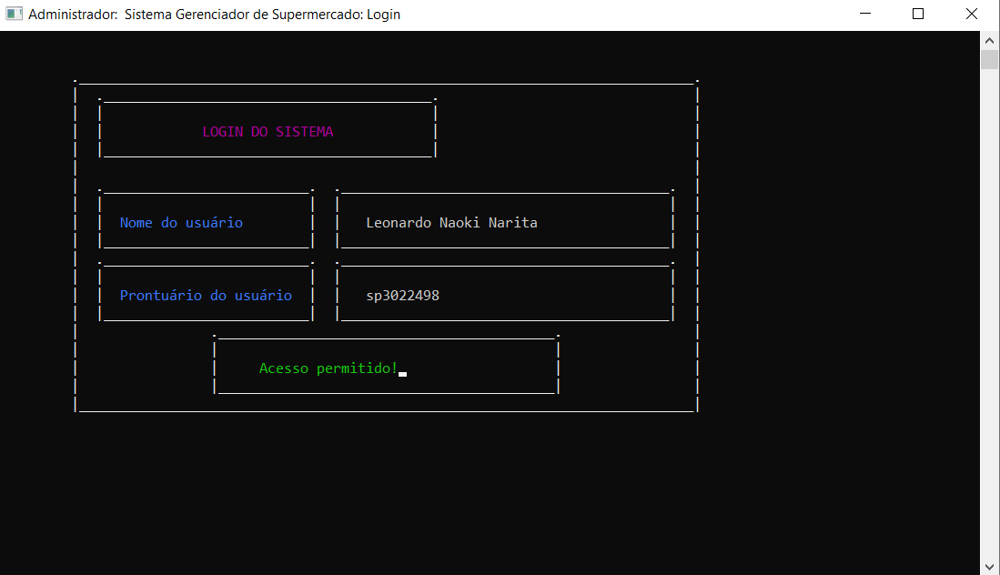
 

### 2. Tela Central

Essa tela redireciona o usuário às demais telas.

 
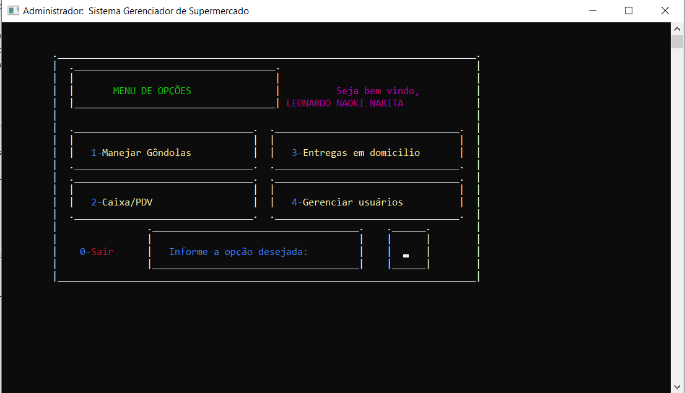
 

### 3. Tela de senha de usuário-master

Essa tela de senha garante que apenas usuários autorizados sejam capazes de manejar gôndolas (opção 1) e gerenciar usuários (opção 4).

 
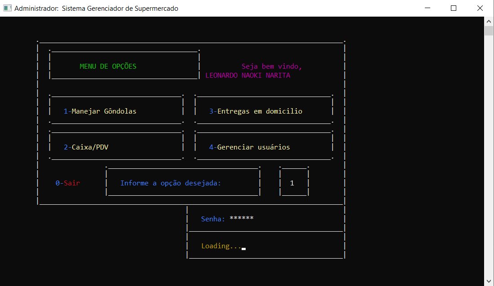
 

### 4. Tela de Manejar Gôndolas

 
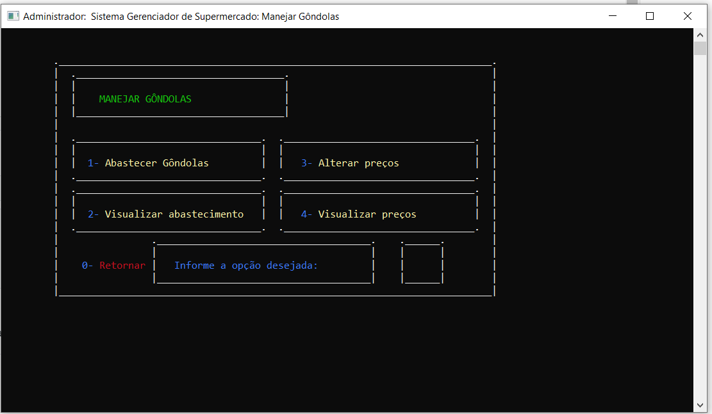
 

Essa tela possibilita mais 4 opções para o usuário realizar a manutenção dos produtos:

#### a. Abastecer Gôndolas

Cada produto é representado no código por uma pilha de prioridade, onde o ultimo a ser inserido é o primeiro a ser retirado, mas essa organização é feita de modo que seja organizada pela data de validade, de modo que os produtos que estiverem mais próximos de expirarem sejam os primeiros a serem removidos. Para realizar isso, são usados estruturas de pilhas auxiliares.
Com isso, cada produto possui um arquivo onde é armazenado os dados. Também são feitas validações para que a data de validade seja aceitável (existente e não expirada). Ao expirar um produto, é exibida uma mensagem avisando que expirou.

 
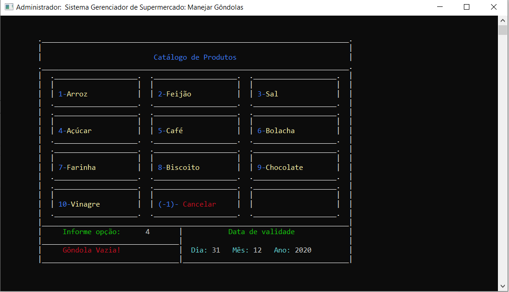
 

#### b. Visualizar abastecimento

São informados quantos produtos há nas gôndolas através dos dados dos arquivos.

 
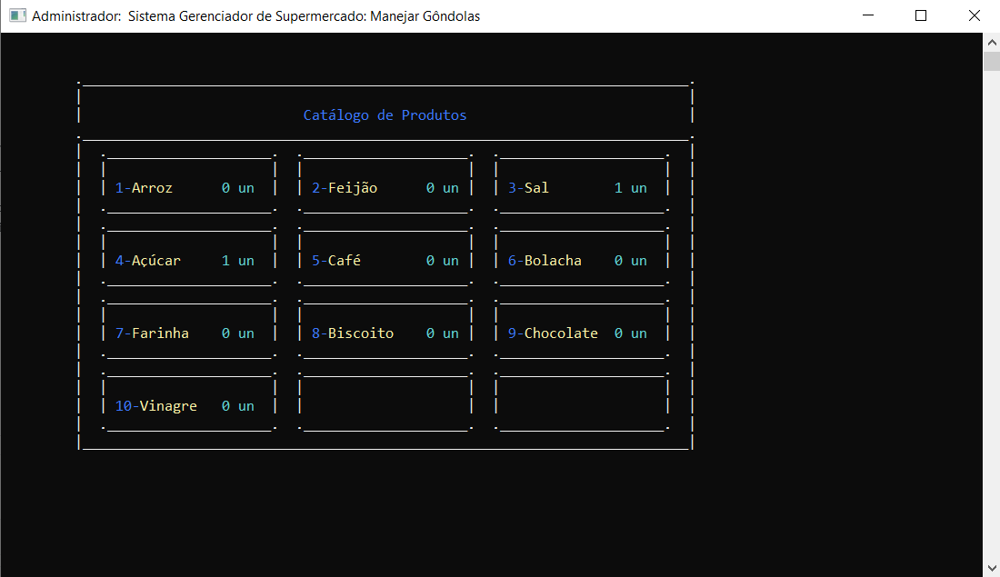
 

#### c. Alterar preços

Os preços alterados são informados em arquivos. Os preços também possuem validação.

 
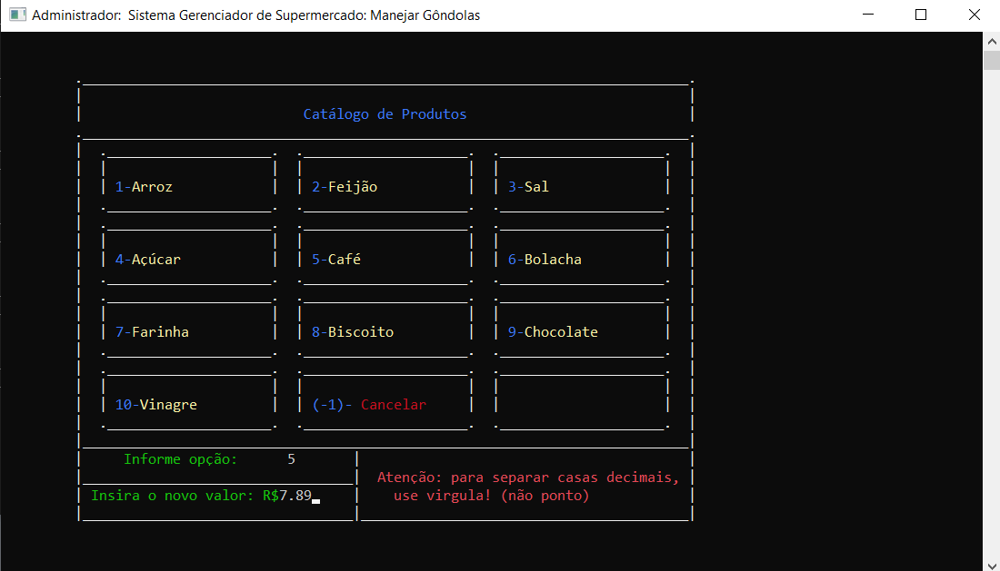
 

#### d. Visualizar preços

São informados os preços dos produtos através dos arquivos.

 

 

### 5. Caixa

Na primeira tela, são selecionados os produtos e sua quantidade até pressionar prosseguir.

 
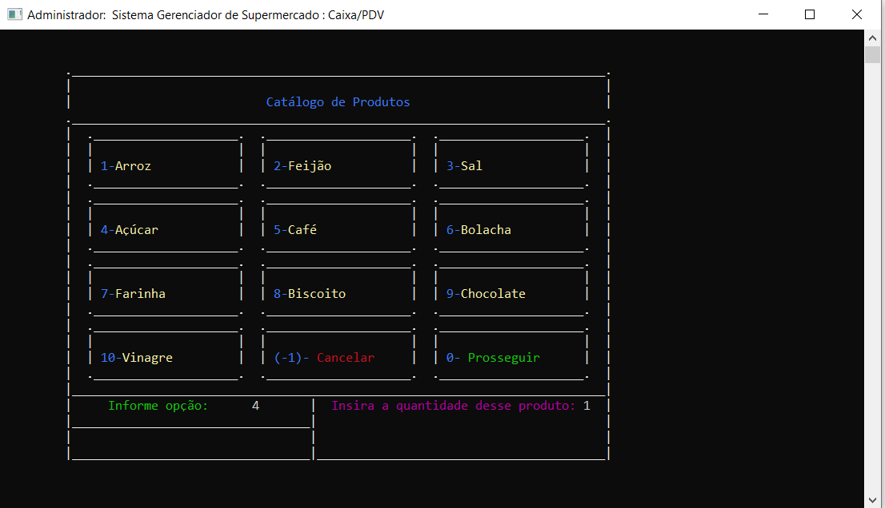
 

Em seguida, é realizado o pagamento. Caso seja em dinheiro, é dado o troco. Caso seja o cartão, é necessário informar o numero e a senha (que será oculta)

 
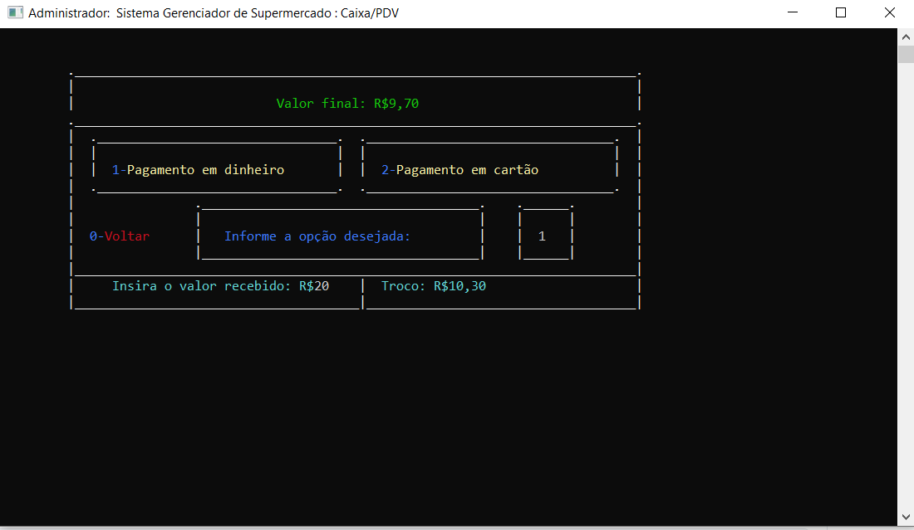
 

Por fim, é gerada a nota fiscal, que será impressa na tela e em formato de arquivo. Para que não haja sobreposição de arquivo, o arquivo tem a data e o horário no nome.

 
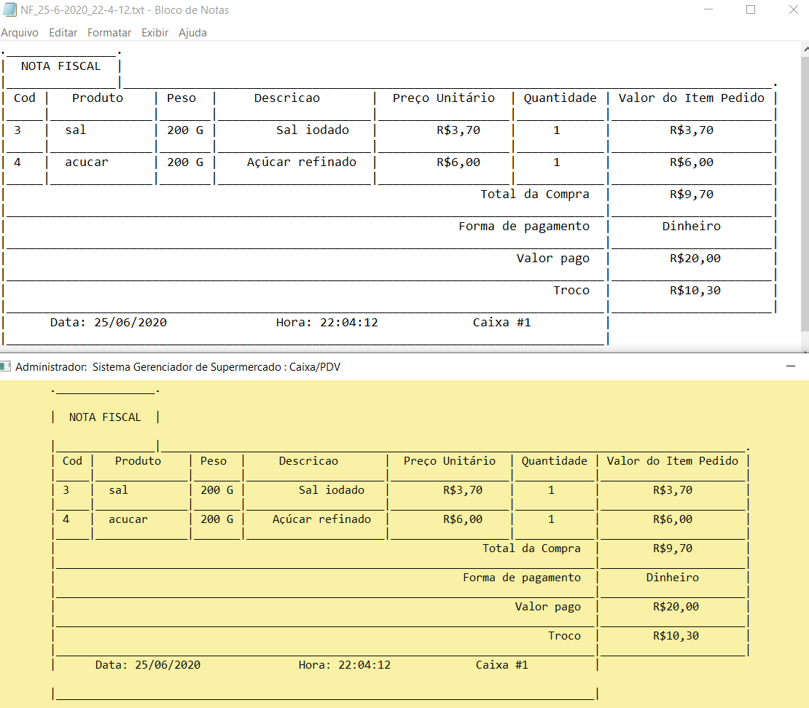
 

### 6. Entrega

Na primeira tela, são solicitados o nome e o endereço com dois campos de input. Em seguida, as telas são as mesmas da opção 5 (Caixa).

### 7. Gerenciar Usuários

 
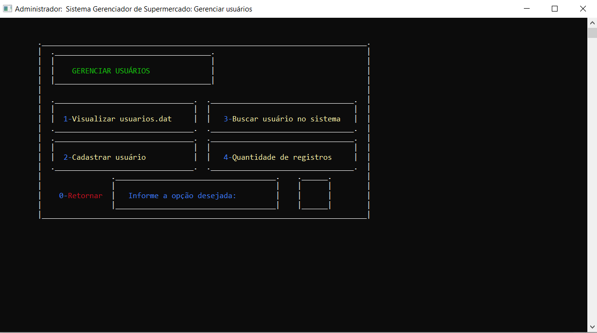
 

Essa tela ramifica para outras 4 telas:

#### a. Visualizar usuarios.dat

Exibe todos os dados em tela.

#### b. Cadastrar usuário

Exibe dois inputs para cadastro de usuário para acessar o sistema. Ao cadastrar, os dados são ordenados via merge sort.

#### c. Buscar usuário

Exibe dois inputs para verificar se usuário está cadastrado no sistema

#### d. Quantidade de registro

Exibe quantas pessoas têm acesso ao sistema.

